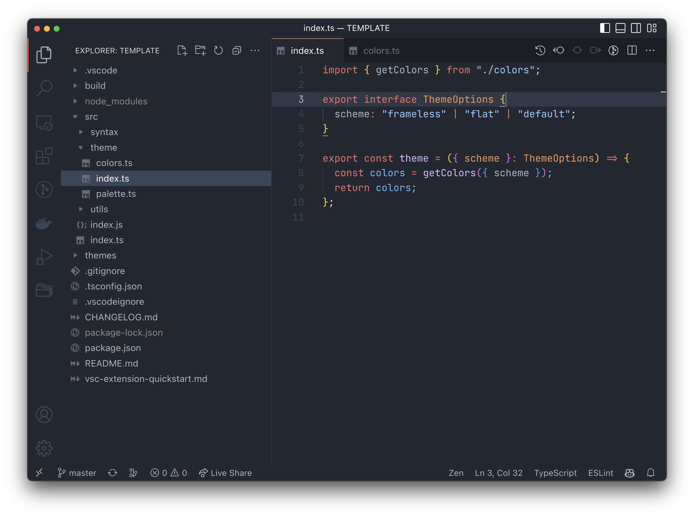

# Carnation Theme for VS Code

---

### A dark theme for VS Code with a carnation scent!

#### There are three variations included: **Carnation**, **Carnation Frameless** and **Carnation Flat**.

---

Installation is simple, just search for "Carnation" in the extensions tab in VS Code or download it from the [Marketplace](https://marketplace.visualstudio.com/items?itemName=vlchristos.carnation-vscode-theme).

---

#### **Carnation**

#### **Carnation Frameless**

#### **Carnation Flat**

_Syntax highlighting is borrowed from GitHub's VS Code theme as well as the the inspiration for the theme color scheme._

## **Enjoy!**

:)
